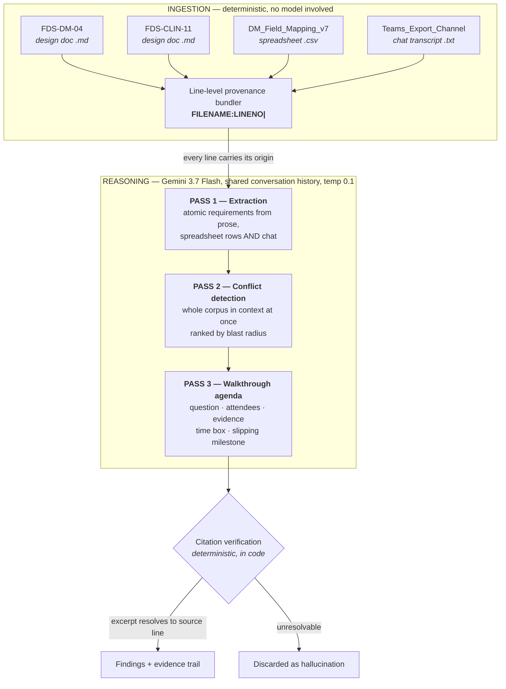

<div align="center">

# Aurora

### The Requirements Conflict Engine

**Two design documents. Both approved. Five weeks apart. Mutually exclusive.**
**Nobody noticed — because nobody reads every document.**

[](https://aurora-requirements-conflict-engine.ai.studio/)
[](https://ai.google.dev/)
[](./LICENSE)

</div>

---

## The thirty-second version

A hospital is migrating a million patient records to a new platform. Two teams write two design documents.

> **FDS-DM-04** *(Data Migration, approved 14 January)* — line 25
> *"All migrated allergy records shall be rendered immediately visible and active in the Aurora Allergy & Intolerance clinical summary panel upon initial user login at go-live."*

> **FDS-CLIN-11** *(Clinical Design, approved 19 February)* — line 16
> *"The Aurora Allergy & Intolerance clinical summary panel shall be **unpopulated and empty** at go-live... unverified legacy data does not compromise acute prescribing decisions."*

Both passed governance. Different workstreams, different reviewers, no shared approver. At cutover, either 1.4 million allergy records land in a panel the Clinical Safety Group ruled unsafe for prescribing — or the panel is empty and the reconciliation report expects it populated.

**Aurora finds this in 23 seconds, and cites both lines.**

---

## What it actually produces

Not a document. Not a lint report. **The agenda for the next stakeholder walkthrough** — the ranked list of decisions that need a human in a room, each with the question to ask, who needs to be there, the evidence pack, a time box, and the milestone that slips if it isn't resolved.

> *The model doesn't replace the walkthrough. It writes the agenda for it.*

## Validated run

| | |
|:--|:--|
| **Requirements extracted** | **32** across 4 heterogeneous sources |
| **Findings surfaced** | **5** — ranked by blast radius |
| **Citations verified against source** | **16 verified · 0 rejected** |
| **Wall clock** | **23.4s** |
| **Model** | `gemini-3.7-flash` |

Validated against a synthetic corpus containing two planted defects and two secondary signals. All four were identified. Raw output is committed in [`out/`](./out).

### What it found

| ID | Type | Severity | Blast radius |
|:--|:--|:--|--:|
| **F-01** | Cross-workstream contradiction — panel populated vs mandatory empty | `CRITICAL` | 98 |
| **F-02** | Algorithmic severity derivation prohibited by Clinical Safety Group | `CRITICAL` | 92 |
| **F-03** | Verbal override — cancelled in chat, reached the CSV, never reached the spec | `HIGH` | 85 |
| **F-04** | Orphan dependency — ward-code mapping with no governing specification | `MEDIUM` | 74 |
| **F-05** | Governance gap — walkthrough cancelled, unminuted, version bump unowned | `MEDIUM` | 62 |

F-03 is the one that matters most in practice. A pharmacy SME killed a requirement **verbally, in a Teams message**. It propagated to the field mapping sheet. It never propagated back to the approved design document. The source of truth for that field is currently a chat message from February.

---

## Why the citations are trustworthy

This is the part that makes it a tool rather than a plausible-sounding text generator.

**Every line of the corpus is prefixed with `FILENAME:LINENO| ` before it ever reaches the model.** That prefix is the entire provenance mechanism.

Then — critically — **citation verification runs in code, not in the prompt.** Each `{file, line, verbatim_excerpt}` is looked up against the original source text. If the excerpt isn't there, the finding is discarded before it reaches the UI. The header shows the live count: *16 verified, 0 rejected.*

A finding without a resolvable citation is treated as a hallucination, not a result. That was a design constraint, not a discovery.

---

## Architecture



### Why every requirement is in context simultaneously

There is deliberately **no retrieval step**. The finding *is* the relationship between two documents — retrieval would surface the relevant one, but the problem is precisely that neither author knew the other document existed. Conflict detection is a whole-corpus operation, which is what a large context window is genuinely good for and what a human reviewer structurally cannot do.

---

## Quickstart

**Prerequisites** — Node.js 18+ and a Gemini API key.

```bash
npm install
```

```bash
cp .env.example .env   # then add your GEMINI_API_KEY
```

```bash
npm run dev
```

Open `http://localhost:3000`.

To run the pipeline headlessly and write the JSON artifacts to `out/`:

```bash
npm run analyse
```

---

## Roadmap

**Hybrid on-device extraction.** A real migration corpus contains clinical workflows, staff names and sample patient identifiers, which is why organisations of this size are reluctant to put one through a cloud API. The intended architecture runs extraction and PII flagging locally via Ollama, so only de-identified requirement objects — a few KB of JSON — leave the machine, while cross-document reasoning stays on Flash. The routing and automatic cloud fallback are implemented in [`server.ts`](./server.ts); the local branch is not yet validated end-to-end, and every run in this repository executed fully on Gemini.

**Live ingestion** from Confluence, Jira and Teams, so the conflict set updates as requirements change rather than being a point-in-time audit.

**Multimodal extraction** from BPMN, Visio and legacy screenshots, which make up a large fraction of any real corpus.

**Confidence weighting** to separate a hard contradiction from an ambiguity a human should adjudicate.

---

## Corpus

Fully synthetic, authored from scratch. No real client data. The demo domain is Meridian Health NHS Foundation Trust migrating from a legacy PAS to a new EPR — four artefacts covering the allergy-records slice of a patient data migration: two approved design specifications from different workstreams, a twelve-row field mapping sheet, and a Teams channel export.

## License

MIT — see [LICENSE](./LICENSE).
