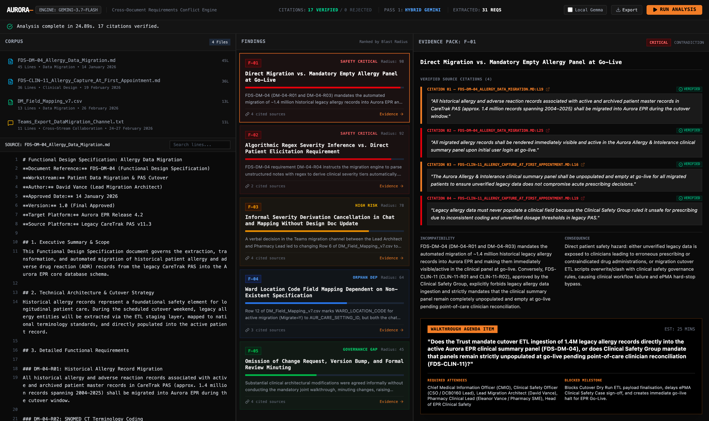
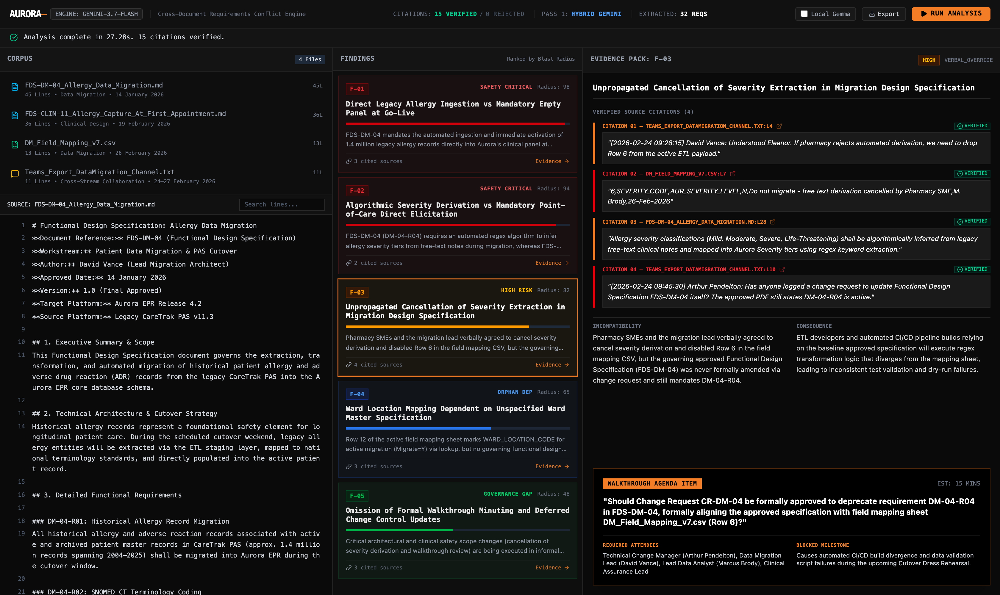
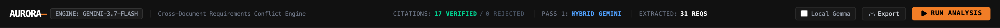
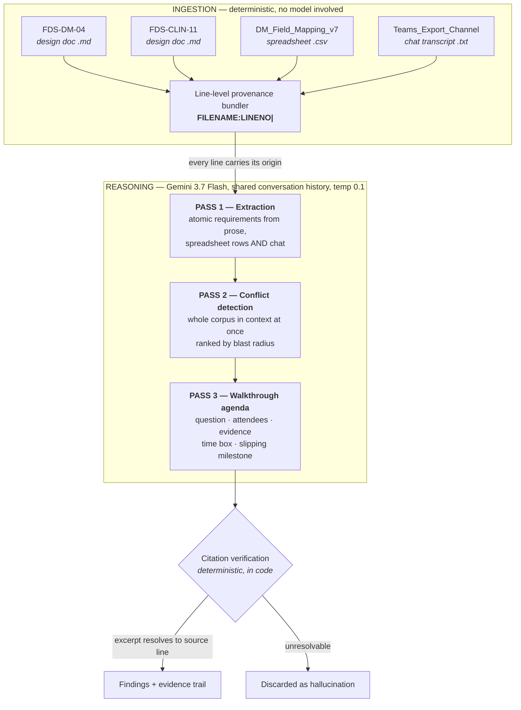

<div align="center">

# Aurora

### The Requirements Conflict Engine

**Two design documents. Both approved. Five weeks apart. Mutually exclusive.**
**Nobody noticed — because nobody reads every document.**

<br/>

## ▶ [**TRY THE LIVE DEMO**](https://aurora-requirements-conflict-engine.ai.studio/)

### [aurora-requirements-conflict-engine.ai.studio](https://aurora-requirements-conflict-engine.ai.studio/)

**No setup, no API key, no install.** Open it and press **RUN ANALYSIS**.

<br/>

[](https://ai.google.dev/)
[](./LICENSE)
[](#why-you-can-trust-the-citations)

</div>

---



---

## The thirty-second version

A hospital is migrating a million patient records to a new platform. Two teams write two design documents.

> **FDS-DM-04** *(Data Migration, approved 14 January)* — line 25
> *"All migrated allergy records shall be rendered immediately visible and active in the Aurora Allergy & Intolerance clinical summary panel upon initial user login at go-live."*

> **FDS-CLIN-11** *(Clinical Design, approved 19 February)* — line 16
> *"The Aurora Allergy & Intolerance clinical summary panel shall be **unpopulated and empty** at go-live... unverified legacy data does not compromise acute prescribing decisions."*

Both passed governance. Different workstreams, different reviewers, no shared approver. At cutover, either 1.4 million allergy records land in a panel the Clinical Safety Group ruled unsafe for prescribing — or the panel is empty and the reconciliation report expects it populated.

**Aurora finds this in under 30 seconds, and cites both lines.**

---

# How the dashboard works

In plain language: **you press one button, and the screen fills up with the arguments your team is about to have.**

The layout is three columns, left to right — *what went in*, *what's wrong*, *how we know*.

### Before you press anything

The app opens showing a previous run, so it's never a blank screen. Nothing has been sent anywhere yet.

### Press **RUN ANALYSIS** (top right)

A progress bar walks through three stages, roughly 25 seconds in total:

| Stage | What's happening |
|:--|:--|
| **Pass 1 — Extraction** | Reads all four files and pulls out every individual requirement — including the ones buried in chat messages |
| **Pass 2 — Detection** | Holds all of them in mind at once and works out which ones can't both be true |
| **Pass 3 — Agenda** | Turns each conflict into a meeting item: the question, who's needed, how long it'll take |

Then a green line appears: *"Analysis complete in 24.89s. 17 citations verified."*

### Column 1 — CORPUS *(what went in)*

The four source files, with their line counts and dates. **Click any file** to read it in the panel below, with line numbers down the side. This is the raw material — two approved design specifications from different teams, a field mapping spreadsheet, and an exported Teams chat.

The chat file matters more than it looks. Decisions get made in chat and never make it back into the official document, and Aurora treats a chat message as just as real a requirement as a numbered clause in a signed-off spec.

### Column 2 — FINDINGS *(what's wrong)*

Every conflict found, **ranked by blast radius** — how much damage it does if nobody catches it. Patient safety sorts above paperwork problems.

Each card shows a coloured severity bar and a **Radius** score out of 100. Red is a safety-critical contradiction, amber is a high-risk process failure, blue and green are dependency and governance gaps. **Click any card** to open it.

### Column 3 — EVIDENCE PACK *(how we know)*

This is the column that makes it a tool rather than a chatbot.

- **Verified source citations** — each one shows the exact file and line (`FDS-DM-04...MD:L25`), the sentence quoted word for word, and a green **VERIFIED** tick. That tick means the quote was checked against the real file *in code*. Nothing unverified is displayed.
- **Incompatibility** — why the two requirements can't both be satisfied, in one paragraph.
- **Consequence** — what actually happens to patients or to the programme if it isn't resolved.
- **Walkthrough agenda item** *(the black block at the bottom)* — the question to put to the room, who needs to be there by job title, an estimated time box, and the milestone that slips.

### The header counters

`CITATIONS: 17 VERIFIED / 0 REJECTED` is the honesty meter. If the model had invented a quote, it would appear in the rejected count and never reach the screen.

`EXTRACTED: 31 REQS` is how many individual requirements were pulled out of the four files.

### **Export**

Downloads three JSON files — `requirements.json`, `findings.json`, `agenda.json` — for feeding into Jira, a change request, or the actual meeting invite. Sample output is committed in [`out/`](./out).

---

## The finding that matters most



**F-03** is the one experienced programme people react to. A pharmacy SME cancelled a requirement **verbally, in a Teams message**, on 24 February. It reached the field mapping spreadsheet two days later. It never reached the approved design document.

Look at the citations in the screenshot: a chat message, a spreadsheet row, and a design document clause — three different file formats, one contradiction between them. The source of truth for that field is currently a chat message from February, and the approved specification still instructs developers to build the opposite.

---

## What it produces

Not a document. Not a lint report. **The agenda for the next stakeholder walkthrough.**

> *The model doesn't replace the walkthrough. It writes the agenda for it.*

### Findings from a representative run

| ID | Type | Severity | Blast radius |
|:--|:--|:--|--:|
| **F-01** | Cross-workstream contradiction — panel populated vs mandatory empty | `CRITICAL` | 98 |
| **F-02** | Algorithmic severity derivation prohibited by Clinical Safety Group | `CRITICAL` | 92 |
| **F-03** | Verbal override — cancelled in chat, reached the CSV, never reached the spec | `HIGH` | 82 |
| **F-04** | Orphan dependency — ward-code mapping with no governing specification | `MEDIUM` | 65 |
| **F-05** | Governance gap — walkthrough cancelled, unminuted, version bump unowned | `MEDIUM` | 48 |

Validated against a synthetic corpus containing two planted defects and two secondary signals. **All four were identified on every run.**

Because extraction is generative, exact counts move slightly between runs — observed across three consecutive runs: **31–32 requirements**, **15–17 citations**, **24–28 seconds**, and **5 findings with 0 citations rejected every time**. The committed artifacts in [`out/`](./out) are one specific run, not an average.

---

## Why you can trust the citations

This is the part that makes it a tool rather than a plausible-sounding text generator.

**Every line of the corpus is prefixed with `FILENAME:LINENO| ` before it ever reaches the model.** That prefix is the entire provenance mechanism.

Then — critically — **citation verification runs in code, not in the prompt.** Each `{file, line, verbatim_excerpt}` is looked up against the original source text. If the excerpt isn't there, the finding is discarded before it reaches the UI.



A finding without a resolvable citation is treated as a hallucination, not a result. That was a design constraint, not a discovery.

---

## Architecture



### Why there is no retrieval step

Deliberately **no RAG**. The finding *is* the relationship between two documents — retrieval would surface the relevant one, but the problem is precisely that neither author knew the other document existed. Conflict detection is a whole-corpus operation, which is what a large context window is genuinely good for and what a human reviewer structurally cannot do.

---

## Run it yourself

**Prerequisites** — Node.js 18+ and a Gemini API key.

```bash
npm install
```

```bash
cp .env.example .env   # then add your GEMINI_API_KEY
```

```bash
npm run dev
```

Open `http://localhost:3000`.

To run the pipeline headlessly and write the JSON artifacts to `out/`:

```bash
npm run analyse
```

---

## Roadmap

**Hybrid on-device extraction.** A real migration corpus contains clinical workflows, staff names and sample patient identifiers, which is why organisations of this size are reluctant to put one through a cloud API. The intended architecture runs extraction and PII flagging locally via Ollama, so only de-identified requirement objects — a few KB of JSON — leave the machine, while cross-document reasoning stays on Flash. The routing and automatic cloud fallback are implemented in [`server.ts`](./server.ts); the local branch is not yet validated end-to-end, and every run in this repository executed fully on Gemini.

**Live ingestion** from Confluence, Jira and Teams, so the conflict set updates as requirements change rather than being a point-in-time audit.

**Multimodal extraction** from BPMN, Visio and legacy screenshots, which make up a large fraction of any real corpus.

**Confidence weighting** to separate a hard contradiction from an ambiguity a human should adjudicate.

---

## The corpus

Fully synthetic, authored from scratch. **No real client data.** The demo domain is Meridian Health NHS Foundation Trust migrating from a legacy PAS to a new EPR — four artefacts covering the allergy-records slice of a patient data migration: two approved design specifications from different workstreams, a twelve-row field mapping sheet, and a Teams channel export.

<div align="center">

<br/>

## ▶ [**TRY THE LIVE DEMO**](https://aurora-requirements-conflict-engine.ai.studio/)

<br/>

</div>

## License

MIT — see [LICENSE](./LICENSE).
