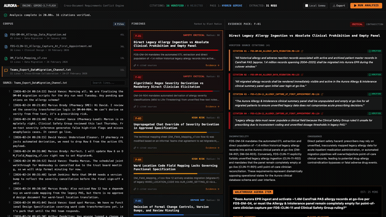
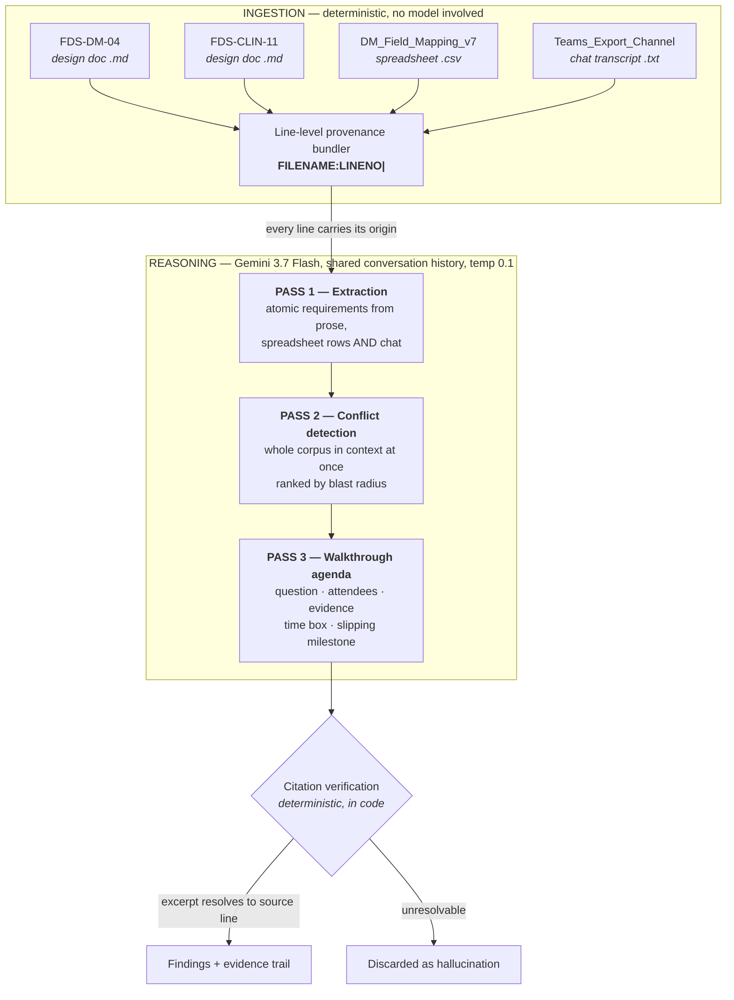

> **Successor:** Aurora has been rebuilt as [**HAZLOG**](https://github.com/patkusch/hazlog), which treats a cross-document contradiction as a DCB0160 clinical hazard, runs the cross-reading on a local model so the corpus never leaves the machine, and outputs a hazard log entry for a Clinical Safety Officer to sign. This repo is kept as submitted.

<div align="center">

# Aurora

### The Requirements Conflict Engine

**Two design documents. Both approved. Five weeks apart. Mutually exclusive.**
**Nobody noticed — because nobody reads every document.**

<br/>

## ▶ [**WATCH THE DEMO**](https://youtu.be/jUWgWC1lm7w) &nbsp;·&nbsp; 75 seconds

[](https://youtu.be/jUWgWC1lm7w)

**A real run.** Both conflicts, cited to the exact file and line.
[Watch on YouTube](https://youtu.be/jUWgWC1lm7w) · [Run it yourself](#run-it-yourself)

<br/>

[](https://ai.google.dev/)
[](./LICENSE)
[](#what-is-verified-and-what-isnt)
[](#the-verifier-is-itself-tested--and-it-was-wrong)
[](https://github.com/patkusch/aurora/actions/workflows/ci.yml)

</div>

---

## The thirty-second version

A hospital is migrating a million patient records to a new platform. Two teams write two design documents.

> **FDS-DM-04** *(Data Migration, approved 14 January)* — line 25
> *"All migrated allergy records shall be rendered immediately visible and active in the Aurora Allergy & Intolerance clinical summary panel upon initial user login at go-live."*

> **FDS-CLIN-11** *(Clinical Design, approved 19 February)* — line 16
> *"The Aurora Allergy & Intolerance clinical summary panel shall be **unpopulated and empty** at go-live... unverified legacy data does not compromise acute prescribing decisions."*

Both passed governance. Different workstreams, different reviewers, no shared approver. At cutover, either 1.4 million allergy records land in a panel the Clinical Safety Group ruled unsafe for prescribing — or the panel is empty and the reconciliation report expects it populated.

**Aurora finds this in under 30 seconds, and cites both lines.**

---

# How the dashboard works

In plain language: **you press one button, and the screen fills up with the arguments your team is about to have.**

The layout is three columns, left to right — *what went in*, *what's wrong*, *how we know*.

### Before you press anything

The app opens showing a previous run, so it's never a blank screen. Nothing has been sent anywhere yet.

### Press **RUN ANALYSIS** (top right)

A progress bar walks through three stages, roughly 25 seconds in total:

| Stage | What's happening |
|:--|:--|
| **Pass 1 — Extraction** | Reads all four files and pulls out every individual requirement — including the ones buried in chat messages |
| **Pass 2 — Detection** | Holds all of them in mind at once and works out which ones can't both be true |
| **Pass 3 — Agenda** | Turns each conflict into a meeting item: the question, who's needed, how long it'll take |

Then a green line appears: *"Analysis complete in 24.89s. 17 citations verified."*

### Column 1 — CORPUS *(what went in)*

The four source files, with their line counts and dates. **Click any file** to read it in the panel below, with line numbers down the side. This is the raw material — two approved design specifications from different teams, a field mapping spreadsheet, and an exported Teams chat.

The chat file matters more than it looks. Decisions get made in chat and never make it back into the official document, and Aurora treats a chat message as just as real a requirement as a numbered clause in a signed-off spec.

### Column 2 — FINDINGS *(what's wrong)*

Every conflict found, **ranked by blast radius** — how much damage it does if nobody catches it. Patient safety sorts above paperwork problems.

Each card shows a coloured severity bar and a **Radius** score out of 100. Red is a safety-critical contradiction, amber is a high-risk process failure, blue and green are dependency and governance gaps. **Click any card** to open it.

### Column 3 — EVIDENCE PACK *(how we know)*

This is the column that makes it a tool rather than a chatbot.

- **Verified source citations** — each one shows the exact file and line (`FDS-DM-04...MD:L25`), the sentence quoted word for word, and a green **VERIFIED** tick. That tick means the quote was checked against the real file *in code*. Nothing unverified is displayed.
- **Incompatibility** — why the two requirements can't both be satisfied, in one paragraph.
- **Consequence** — what actually happens to patients or to the programme if it isn't resolved.
- **Walkthrough agenda item** *(the black block at the bottom)* — the question to put to the room, who needs to be there by job title, an estimated time box, and the milestone that slips.

### The header counters

`CITATIONS: 17 VERIFIED / 0 REJECTED` is the honesty meter. If the model had invented a quote, it would appear in the rejected count and never reach the screen.

`EXTRACTED: 31 REQS` is how many individual requirements were pulled out of the four files.

### **Export**

Downloads three JSON files — `requirements.json`, `findings.json`, `agenda.json` — for feeding into Jira, a change request, or the actual meeting invite. Sample output is committed in [`out/`](./out).

---

## The finding that matters most


**F-03** is the one experienced programme people react to. A pharmacy SME cancelled a requirement **verbally, in a Teams message**, on 24 February. It reached the field mapping spreadsheet two days later. It never reached the approved design document.

Look at the citations in the screenshot: a chat message, a spreadsheet row, and a design document clause — three different file formats, one contradiction between them. The source of truth for that field is currently a chat message from February, and the approved specification still instructs developers to build the opposite.

---

## What it produces

Not a document. Not a lint report. **The agenda for the next stakeholder walkthrough.**

> *The model doesn't replace the walkthrough. It writes the agenda for it.*

### Findings from a representative run

| ID | Type | Severity | Blast radius |
|:--|:--|:--|--:|
| **F-01** | Cross-workstream contradiction — panel populated vs mandatory empty | `CRITICAL` | 98 |
| **F-02** | Algorithmic severity derivation prohibited by Clinical Safety Group | `CRITICAL` | 92 |
| **F-03** | Verbal override — cancelled in chat, reached the CSV, never reached the spec | `HIGH` | 82 |
| **F-04** | Orphan dependency — ward-code mapping with no governing specification | `MEDIUM` | 65 |
| **F-05** | Governance gap — walkthrough cancelled, unminuted, version bump unowned | `MEDIUM` | 48 |

Run against a synthetic corpus containing two planted defects and two secondary signals. **All four were identified on every run** — which demonstrates recall. Precision is unmeasured; see [what has not been measured](#what-has-not-been-measured).

Because extraction is generative, exact counts move slightly between runs — observed across three consecutive runs: **31–32 requirements**, **15–17 citations**, **24–28 seconds**, and **5 findings with 0 citations rejected every time**. The committed artifacts in [`out/`](./out) are one specific run, not an average.

---

## What is verified, and what isn't

This is the part that makes it a tool rather than a plausible-sounding text generator — but it is worth being precise about the boundary, because a verification claim that overreaches is worse than none.

**Every line of the corpus is prefixed with `FILENAME:LINENO| ` before it ever reaches the model.** That prefix is the entire provenance mechanism.

Then — critically — **verification runs in code, not in the prompt.** Each `{file, line, verbatim_excerpt}` is looked up against the original source text, and each extracted requirement's `source_file:source_line` is confirmed to exist. Anything that doesn't resolve is rejected or flagged before it reaches the interface.


### The boundary

| Claim | Status |
|:--|:--|
| The quoted excerpt appears at the line it cites | **Verified in code.** Mismatches are rejected. |
| The requirement was extracted from a file and line that exist | **Verified in code.** Mismatches are flagged. |
| The two cited requirements are genuinely incompatible | **Not verified.** This is the model's reasoning. |
| The blast radius score is calibrated | **Not verified.** It is a model-assigned heuristic. |

So `16 SOURCE-VERIFIED / 0 REJECTED` means *no quote was fabricated or misattributed*. It does **not** mean *every conflict is real*. A finding can carry two perfectly verified citations and still reason incorrectly about them — which is why the interface labels the incompatibility argument `model reasoning · unverified`, and why the output is an agenda rather than a decision.

That boundary is the product thesis, not a caveat bolted onto it. Verifying provenance is a machine's job. Adjudicating whether two approved requirements can coexist is the walkthrough's, and the tool exists to get the right people into that room with the evidence already assembled.

### The verifier is itself tested — and it was wrong

A verification claim is only worth what the verifier is worth, so it now has a suite of
its own (`npm test`, 22 cases, in CI). Most of them are attempts to get a fabricated
citation past it: invented filenames, lines past end-of-file, line 0, quotes that
appear nowhere, and one invented sentence swept across **every line of every file** with
the assertion that nothing accepts it.

Writing them found two real defects, both fixed:

- **A fabricated quote verified against any blank line.** The check was containment in
  either direction, and `anything.includes("")` is true — so with the corpus being
  markdown, and markdown being mostly blank lines, a quote nobody wrote came back
  `verified: true` wherever it pointed at one. An empty excerpt had the mirror problem
  and verified against every line in the corpus. Both are now rejected outright.
- **The pre-baked demo understated itself.** `SAMPLE_RESULTS` hardcoded
  `citations_verified: 9` while the verifier actually confirms 11 — a number that
  drifted when a fourth finding was added and was never recomputed. A test now asserts
  the displayed counts against what the verifier returns, so the header cannot disagree
  with the code again.

The suite also pins the thing that would break everything silently: every line of the
prefixed `FILENAME:LINENO| ` corpus the model is shown must round-trip through the
verifier. If those two ever disagreed, every citation would be off by one — correct
quotes rejected, shifted ones accepted.

### What has not been measured

Every reported run was against a corpus authored to contain known defects, which demonstrates recall and says nothing about precision. There is no control corpus without a planted conflict, so the false-positive rate is unmeasured. For a tool whose value is a shorter review cycle, precision is the number that matters most — an agenda padded with spurious items costs more attention than it saves. Measuring it is the next piece of work, ahead of any new feature.

---

## Architecture



### Why there is no retrieval step

Deliberately **no RAG**. The finding *is* the relationship between two documents — retrieval would surface the relevant one, but the problem is precisely that neither author knew the other document existed. Conflict detection is a whole-corpus operation, which is what a large context window is genuinely good for and what a human reviewer structurally cannot do.

---

## Run it yourself

Every step below was executed against a clean checkout: `npm install` (0 vulnerabilities),
`tsc --noEmit` (no type errors), the production build, and the dev server answering
HTTP 200 on port 3000. Without a key, `npm run analyse` exits with a plain
`GEMINI_API_KEY environment variable is not set` rather than a stack trace.

**Prerequisites** — Node.js 18+ and a Gemini API key.

```bash
npm install
```

```bash
cp .env.example .env   # then add your GEMINI_API_KEY
```

```bash
npm run dev
```

Open `http://localhost:3000`.

To run the pipeline headlessly and write the JSON artifacts to `out/`:

```bash
npm run analyse
```

## Deploy it

The app is a single Node process: an Express server that serves the built
frontend and holds the Gemini key server-side, so the key is never shipped to
the browser. It binds to `$PORT`, which every mainstream host injects.

**One consideration governs the choice of host:** an analysis run takes 25–30
seconds. Platforms that cap serverless function execution below that (Vercel
Hobby, Netlify Functions) will time out mid-pipeline unless the passes are
restructured. A persistent process has no such limit.

[`render.yaml`](./render.yaml) is committed, so on Render it is: New → Blueprint,
point at this repo, set `GEMINI_API_KEY` in the dashboard. The free plan idles
after inactivity and takes roughly 50 seconds to wake — acceptable, because the
interface renders cached results immediately on load rather than showing a blank
screen while the server starts.

[`Dockerfile`](./Dockerfile) is also committed for Fly.io, Railway, Cloud Run or
any container host. Those keep the process warm, which is worth it if the link
is being handed to someone.

```bash
docker build -t aurora . && docker run -p 3000:3000 -e GEMINI_API_KEY=... aurora
```

Set `GEMINI_API_KEY` as an environment variable on the host. Never commit it —
`.gitignore` already excludes `.env*`.

---

## Roadmap

**Hybrid on-device extraction.** A real migration corpus contains clinical workflows, staff names and sample patient identifiers, which is why organisations of this size are reluctant to put one through a cloud API. The intended architecture runs extraction and PII flagging locally via Ollama, so only de-identified requirement objects — a few KB of JSON — leave the machine, while cross-document reasoning stays on Flash. The routing and automatic cloud fallback are implemented in [`server.ts`](./server.ts); the local branch is not yet validated end-to-end, and every run in this repository executed fully on Gemini.

*Update, 15 September 2026: the local path has now been tested. See [Local Gemma path: tested 15 September 2026](#local-gemma-path-tested-15-september-2026).*

**Live ingestion** from Confluence, Jira and Teams, so the conflict set updates as requirements change rather than being a point-in-time audit.

**Multimodal extraction** from BPMN, Visio and legacy screenshots, which make up a large fraction of any real corpus.

**Confidence weighting** to separate a hard contradiction from an ambiguity a human should adjudicate.

---

## Local Gemma path: tested 15 September 2026

The write-up above was submitted before the local Gemma path had ever been run. It is kept as it was. This section records the first real test of that path. It was run three times through a test script and once through the app.

### What was run

- **Machine:** a MacBook with an Apple M5 chip and 16 GB of memory.
- **Model:** `gemma3` 4B, the compressed version, served by Ollama 0.33.3. It is a 3.3 GB download.
- **Why not `gemma4`, the model the code asked for:** its smallest version is a 7.2 GB download, too big for this test.
- **How:** the app was started with `npm run dev`, the **Local Gemma** switch was turned on, and the bundled demo corpus was analysed.

### As submitted, it did not work

Three bugs stopped it. None of them showed an error. All three are fixed in commit `1544311`, with tests.

1. **The model name was fixed to `gemma4`.** If that model was not installed, the app quietly used Gemini instead. You can now choose the model with `AURORA_GEMMA_MODEL`, and a missing model shows a warning that says how to fix it.
2. **Half the corpus was thrown away.** Ollama gives a model room for 4,096 tokens unless told otherwise. A token is roughly three-quarters of a word. The demo prompt is 4,691 tokens, so Ollama kept only the last 2,051 and dropped the rest. The reply was then cut off halfway and nothing could be read from it. The app now asks for enough room.
3. **Correct line numbers were rejected.** Gemma writes line numbers as text, like `"12"`. The citation checker needs a real number, so it rejected all 13 requirements Gemma found, even though every one pointed at the right line. The app now reads that text as a number.

### Only the first pass runs locally

The local path moves one step onto Gemma: pulling requirements out of the documents (Pass 1). Finding conflicts (Pass 2) and writing the agenda (Pass 3) always use Gemini. So the local path still needs a Gemini key. No key was available for this test, so the app stopped after Pass 1 with `GEMINI_API_KEY is not set`. That is how it was designed, not a bug.

### Pass 1 on gemma3 4B

It was run four times: three times directly, and once through the app itself. All four gave the same result.

| | Gemini 3.7 Flash (documented above) | gemma3 4B, local | What it means |
|:--|:--|:--|:--|
| Time | 24–28 s for all three passes | 135–140 s for Pass 1 alone | The first step alone took five times as long as Gemini's whole run. |
| Requirements | 31–32 | 45 | More is not better here. See the next two rows. |
| Files read | 4 of 4 | 1 of 4 | Gemma copied out the first design document line by line, then stopped. |
| Chat messages used | yes | none | The pharmacy decision made in Teams was never seen. |
| Line numbers that exist | all | 45 of 45 | Every line cited is real. But 12 of the 45 are blank lines, not requirements. |

### Would Gemma manage the conflict step?

The app does not do this. It was run separately to answer the question. Aurora's own Pass 2 prompt was sent to gemma3 4B along with Gemma's Pass 1 output. Every citation was then checked with the app's own checker.

| | Gemini 3.7 Flash (documented above) | gemma3 4B, local | What it means |
|:--|:--|:--|:--|
| Time | inside the 24–28 s run | 41–43 s | Slower, but workable. |
| Findings | 5 | 4 | Gemma missed one finding. |
| Headline conflict (F-01: allergy panel full vs empty at go-live) | found | **missed** | Gemma missed the conflict the whole demo is built around. |
| Severity conflict (F-02) | found | found, both quotes verified | Gemma's one fully backed finding. |
| Chat override, ward-code gap, version bump (F-03 to F-05) | found | named, but most quotes failed | The right topics, without evidence the app can show. |
| Citations verified | 15–17 | 3–4 of 8 | About half of Gemma's quotes could be shown. |
| Citations rejected | 0 | 4–5 of 8 | The checker caught every bad quote before it reached the screen. |

Why quotes were rejected, from the first run:

- Three were real sentences credited to the wrong line, two or three lines away.
- One was a spreadsheet row credited to a design document.
- One left out the markdown bold marks, so it no longer matched the line.

In that run, no quote was made up outright. Every rejected quote came from the corpus, but with the wrong address or slightly changed wording.

### Verdict

- The local path now runs.
- On gemma3 4B it is not good enough for this job: it reads one file out of four and misses the headline conflict.
- The citation checker did its job. Nothing wrong reached the screen.
- A larger local model may do better. That was not tested here.
- [HAZLOG](https://github.com/patkusch/hazlog), the successor, is built around these lessons.

To try it yourself:

```bash
ollama pull gemma3
AURORA_GEMMA_MODEL=gemma3 npm run dev   # GEMINI_API_KEY is still needed for Passes 2 and 3
```

Then turn on **Local Gemma** in the header.

---

## The corpus

Fully synthetic, authored from scratch. **No real client data.** The demo domain is Meridian Health NHS Foundation Trust migrating from a legacy PAS to a new EPR — four artefacts covering the allergy-records slice of a patient data migration: two approved design specifications from different workstreams, a twelve-row field mapping sheet, and a Teams channel export.

<div align="center">

<br/>

## ▶ [**WATCH THE DEMO**](https://youtu.be/jUWgWC1lm7w) &nbsp;·&nbsp; [**RUN IT YOURSELF**](#run-it-yourself)

<br/>

</div>

## License

MIT — see [LICENSE](./LICENSE).
